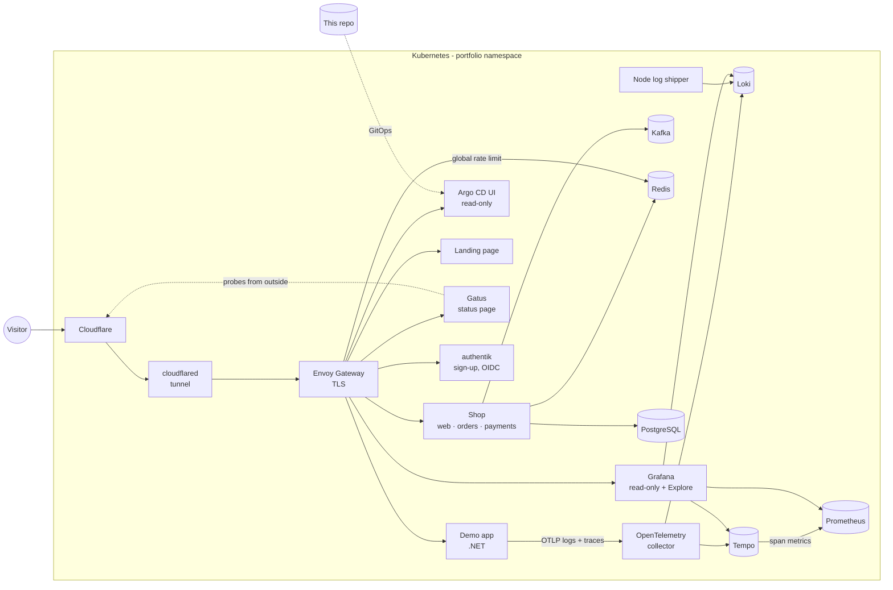

# Portfolio — a small platform, observed end to end

A self-hosted, publicly reachable Kubernetes platform running in my homelab, deployed with
GitOps and fully observable - and a small shop running on it that you can use. Everything in
this repository is live.

| | |
|---|---|
| **Start here** — what this is and how it fits together | https://emersonzulian.dev |
| **Status** — every public endpoint, the GitOps sync state and the backends | https://status.emersonzulian.dev |
| **Grafana** — dashboards and Explore, run your own queries | https://grafana.emersonzulian.dev |
| **Platform dashboard** — Argo CD, Flux, TLS and the edge gateway, from the cluster's own monitoring | https://grafana.emersonzulian.dev/d/portfolio-platform |
| **Argo CD** (read-only) — everything this folder runs | https://argocd.emersonzulian.dev |
| **Sign up / log in** — authentik, with a read-only demo account | https://auth.emersonzulian.dev |
| **Kafka** (read-only) — topics, consumer groups and the shop's events | https://kafka.emersonzulian.dev |
| **Shop** — buy something and follow it through every layer | https://shop.emersonzulian.dev |
| **Receipts** — FileBrowser, your own folder only (login by the gateway) | https://files.emersonzulian.dev |

In Argo CD:
- [the whole tree from the root](https://argocd.emersonzulian.dev/applications/argocd/portfolio?view=tree)
- [the three groups only](https://argocd.emersonzulian.dev/applications?labels=portfolio.emersonzulian.dev%2Flevel%3Dgroup)
- one group's components:
  [platform](https://argocd.emersonzulian.dev/applications?labels=portfolio.emersonzulian.dev%2Fgroup%3Dplatform),
  [observability](https://argocd.emersonzulian.dev/applications?labels=portfolio.emersonzulian.dev%2Fgroup%3Dobservability),
  [apps](https://argocd.emersonzulian.dev/applications?labels=portfolio.emersonzulian.dev%2Fgroup%3Dapps)

## What it demonstrates

- **GitOps with Argo CD.** Every resource comes from this folder through an app-of-apps
  (`argocd/`), ordered with sync waves: platform, then observability, then apps. Pushing a
  change is how you deploy. Nothing is applied by hand.
- **The three pillars of observability, with OpenTelemetry.**
  - Metrics go to Prometheus, logs to Loki and traces to Tempo.
  - The .NET app is auto-instrumented by the OpenTelemetry Operator, with no code changes.
  - Logs carry trace IDs, so Grafana jumps from a log line to its trace and back.
  - Request rate and latency come straight from the traces.
- **No open ports.** Traffic arrives through a Cloudflare Tunnel into a gateway that has no
  external IP. TLS certificates (Let's Encrypt) and DNS records are automated.
- **Public by design, with least privilege.**
  - Grafana is open read-only: anyone can browse the dashboards and query metrics, logs and
    traces in Explore, but can't save anything or log in.
  - Every query is bounded: each backend caps what one query may cost (timeouts, series,
    samples, log lines, trace search size), and the gateway rate-limits queries per visitor.
    Logins and raw backend APIs (datasource proxy, config, targets) answer 404.
  - Argo CD is anonymous and read-only.
  - The namespace is default-deny in both directions: what may enter and leave is listed,
    outbound calls are pinned to hostnames, and the Grafana pod is further confined to its
    three data sources. These are plain Kubernetes `NetworkPolicy` objects. Cilium policies
    are used only for the rules the native API can't express: by hostname, the API server
    and the kubelets.
  - Argo CD projects cap what a commit here can create in the cluster.
- **Isolation.** This stack has its own Prometheus, Loki and Tempo, holding only this
  namespace's data. None of it is shared with the rest of the homelab. Every pod here runs on
  a dedicated node pool (two nodes), placed there by policy, not by each manifest.
- **Policy as code (Kyverno, in CEL).** Admission policies pin pods to the pool, refuse
  mutable image tags, images from unknown registries, and containers without requests, a
  readiness probe or non-root - each rule started in Audit and moved to Deny once nothing
  violated it.
- **Identity (authentik).** Visitors sign up with a username and password (no e-mail; bots
  stopped by Cloudflare Turnstile) or use the demo account, which is read-only - it can't
  change its password, profile or MFA. Flows, the demo account and OIDC clients are
  blueprints in Git.
- **Releases and failures, handled by the platform.** The shop's web app is released as a
  canary (Argo Rollouts): 20% then 50% of real traffic, split on the HTTPRoute, judged on that
  version's own error rate and latency from Tempo's span metrics - a bad release rolls itself
  back. Chaos Mesh kills one shop pod every hour; a k6 shopper keeps traffic flowing through
  the public URL, with a real login, so there's always something to measure.
- **Messaging and state.** Kafka (Strimzi, KRaft) carries the shop's events; Redis holds
  sessions and rate-limit counters - including the gateway's, which is global across Envoy
  replicas. PostgreSQL databases are CloudNativePG clusters; app credentials are generated
  in-cluster and never stored anywhere else.

## Architecture



## Layout

```
gitops/            Everything Argo CD applies
 argocd/            Argo CD Applications - the tree you see in the Argo CD UI
  platform.yaml      ├─ platform        namespace, gateway + TLS, network policies, policies,
                     │                    tunnel, DNS, Kafka, Redis, authentik
  observability.yaml ├─ observability   Prometheus, Loki, Tempo, OpenTelemetry, Grafana
  apps.yaml          └─ apps            what runs on the platform: landing, status, shop, demo
 platform/          namespace/  gateway/  network-policies/  policies/  cloudflare-tunnel/
                    external-dns/  kafka/  redis/  authentik/
 observability/     prometheus/  loki/  tempo/  opentelemetry/  grafana/
 apps/              landing/  status/  shop/  files/  kafka-ui/  traffic/  chaos/
shop/              The shop's source: web/ (Next.js), orders/ and payments/ (.NET)
.github/workflows/ CI: builds the shop's images to ghcr.io/emersonhzulian/portfolio-platform/*
```

Each folder under `gitops/platform/`, `gitops/observability/` and `gitops/apps/` is one Argo CD application.
Every Application carries `portfolio.emersonzulian.dev/level` (`root`, `group` or
`component`), and components also carry `portfolio.emersonzulian.dev/group`. The Argo CD
application list filters on them via `?labels=<key>%3D<value>`. Loki
and Tempo are Helm charts; their folders hold only `values.yaml`.

| Group (sync wave) | Application (wave) | What it is |
|---|---|---|
| platform (0) | `platform-namespace` (-1) | The `portfolio` namespace |
| | `platform-gateway` (0) | Envoy Gateway (ClusterIP), Let's Encrypt `Issuer`, `*.emersonzulian.dev` certificate |
| | `platform-network-policies` (0) | Default-deny for the namespace boundary, in and out: `NetworkPolicy`, plus Cilium only where the native API can't express a rule |
| | `platform-cloudflare-tunnel` (1) | cloudflared, the only way in |
| | `platform-policies` (0) | Kyverno policies (CEL): node-pool pinning, workload rules |
| | `platform-external-dns` (1) | Proxied DNS record to the tunnel for each route |
| | `platform-kafka` (1) | Kafka (Strimzi, KRaft, one node) and the `order.paid` topics |
| | `platform-redis` (1) | Redis: sessions, per-user and gateway (global) rate limits |
| | `platform-authentik` (2) | authentik (chart + CloudNativePG database), sign-up flow, demo account, OIDC clients |
| observability (1) | `observability-prometheus` (0) | Prometheus; container metrics from kubelet / kube-state-metrics filtered to this namespace, plus an allowlist federated from the central Prometheus (Argo CD, Flux, cert-manager, edge Envoy) |
| | `observability-loki` (0) | Loki, 7 days |
| | `observability-tempo` (0) | Tempo, 7 days; span metrics written to Prometheus |
| | `observability-opentelemetry` (1) | OTLP collector, node log shipper, auto-instrumentation config |
| | `observability-grafana` (1) | Grafana, datasources, dashboards (overview + platform), public route, network policy |
| apps (2) | `apps-landing` (0) | Static front page at the apex, two nginx replicas |
| | `apps-status` (0) | Gatus: public endpoints probed from outside, Argo CD sync state, backends |
| | `apps-shop` (0) | The shop ([source](shop/)): web (Next.js), orders and payments (.NET), PostgreSQL |
| | `apps-files` (0) | FileBrowser behind the gateway's OIDC (SecurityPolicy: authentik login + JWT → `X-Auth-User`), one folder per visitor, download only |
| | `apps-kafka-ui` (0) | Kafbat UI: read-only in the UI and at the broker (SCRAM user with read-only ACLs) |
| | `apps-chaos` (0) | Chaos Mesh schedule: one random shop pod killed every hour |
| | `apps-traffic` (0) | Synthetic shopper (k6): browses and buys through the public URL, metrics by remote write |

---

## Running it

### Requirements

The cluster provides these operators; this folder doesn't install them.

| Operator | Tested with | Used for |
|---|---|---|
| [Argo CD](https://argo-cd.readthedocs.io) | v3.5.3 (chart 10.9.5) | Deploys this folder (`argocd/`), Helm charts for Loki and Tempo |
| [Cilium](https://cilium.io) (CNI) | 1.20.2 | Enforces the `NetworkPolicy` objects; `CiliumNetworkPolicy` for the rules by hostname (DNS proxy), the API server and the kubelets |
| [Envoy Gateway](https://gateway.envoyproxy.io) + Gateway API CRDs | 1.9.1 | `Gateway`/`HTTPRoute`, `EnvoyProxy` (ClusterIP service), `HTTPRouteFilter` (404s) |
| [cert-manager](https://cert-manager.io) | v1.21.2 | `Issuer` (Let's Encrypt DNS-01) and the `*.emersonzulian.dev` certificate |
| [External Secrets Operator](https://external-secrets.io) | chart 2.11.0 | `ExternalSecret`s, read from a `ClusterSecretStore` named **`openbao`** |
| [prometheus-operator](https://prometheus-operator.dev) (via kube-prometheus-stack) | chart 91.8.2 | `Prometheus` and `ServiceMonitor` |
| [OpenTelemetry Operator](https://github.com/open-telemetry/opentelemetry-operator) | chart 0.124.0 | `OpenTelemetryCollector`, `Instrumentation` (auto-instrumentation) |
| [grafana-operator](https://grafana.github.io/grafana-operator) | 5.25.0 | `Grafana`, `GrafanaDatasource`, `GrafanaDashboard` (with `publicSharing`) |
| [Kyverno](https://kyverno.io) | 1.19.1 (chart 3.9.1) | `NamespacedValidatingPolicy` / `NamespacedMutatingPolicy` (CEL); its webhooks only watch this namespace |
| [Argo Rollouts](https://argoproj.github.io/rollouts) + Gateway API plugin | 1.10.0 (chart 2.43.6), plugin 0.17.0 | Canary releases with metric analysis, traffic split on the HTTPRoute |
| [Chaos Mesh](https://chaos-mesh.org) | 2.8.4 | Scheduled pod kills; only namespaces annotated `chaos-mesh.org/inject=enabled` |
| [Strimzi](https://strimzi.io) | 1.2.0 | `Kafka`, `KafkaNodePool`, `KafkaTopic` |
| [CloudNativePG](https://cloudnative-pg.io) | 1.30.1 | `Cluster`, `Database` |

Argo CD also needs:
- the OCI Helm repositories `ghcr.io/grafana-community/helm-charts` and `ghcr.io/goauthentik/helm-charts`
  declared with `enableOCI: "true"`;
- the `Application` health check in `argocd-cm`, so waves wait for each child app to be healthy.

The cluster also has to provide:
- the StorageClass `freenas-iscsi-csi`: block storage (RWO) for the Prometheus, Loki, Tempo and Grafana
  volumes - Grafana's SQLite and the TSDBs need a real block device, not NFS;
- the GatewayClass `envoy-gateway`;
- the `kube-state-metrics` Service in `observability` and the kubelet Service
  `kube-prometheus-stack-kubelet` in `kube-system`;
- the namespace `opentelemetry`, labelled `pod-security.kubernetes.io/enforce: privileged`,
  for the node log shipper;
- nodes labelled `portfolio.emersonzulian.dev/pool: "true"` (the pool every pod here is pinned to);
- Envoy Gateway configured with a Redis backend for global rate limits (this folder's Redis).

The central Prometheus must also skip ServiceMonitors labelled
`prometheus.homelab/instance: portfolio`, or it scrapes their targets twice. Every
ServiceMonitor in this folder carries that label (Loki and Tempo through their values).

### Secrets (OpenBao, KV v2 mount `secret/`)

| Path | Property | Value |
|---|---|---|
| `portfolio/cloudflare` | `api-token` | Cloudflare API token for the `emersonzulian.dev` zone only: Zone → DNS → Edit and Zone → Zone → Read |
| `portfolio/cloudflare` | `tunnel-token` | Token of the Cloudflare tunnel |
| `portfolio/cloudflare` | `tunnel-id` | Tunnel UUID; DNS records point at `<tunnel-id>.cfargotunnel.com` |
| `portfolio/grafana` | `admin-password` | Grafana admin password |
| `portfolio/authentik` | `secret-key` | authentik secret key (random, 50+ characters) |
| `portfolio/authentik` | `bootstrap-password` | Password of the `akadmin` admin, set on first start |
| `portfolio/authentik` | `demo-password` | Password of the public `demo` account (shown on the login page) |
| `portfolio/turnstile` | `site-key`, `secret-key` | A Cloudflare Turnstile widget for `auth.emersonzulian.dev` |

App credentials (database logins, the webhook HMAC key, OIDC client secrets) aren't in
OpenBao: External Secrets' Password generator creates them in-cluster, once.

On the Cloudflare side, the tunnel has two public hostnames, `*.emersonzulian.dev` and the
apex `emersonzulian.dev` (a wildcard doesn't cover it), both pointing to `HTTPS`
`envoy-portfolio.envoy-gateway-system.svc.cluster.local:443` with *Match SNI to Host* enabled. external-dns owns the DNS records, so don't let the dashboard create them.

### Installing

The hosting cluster keeps the permissions and the entry point, outside this repository (in my
homelab they're applied by Flux, which also installs Argo CD):

- **AppProject `portfolio`**, used by the components:
  - destinations `portfolio` and `opentelemetry`;
  - cluster-scoped kinds `Namespace`, `ClusterRole` and `ClusterRoleBinding`;
  - sources: this repository and the Grafana and authentik Helm registries.
- **AppProject `portfolio-root`**, for the root and the three group apps. It may only create
  `Application` objects in `argocd`, so a commit here can add or change apps but can't touch
  Argo CD itself.
- **The root Application:** project `portfolio-root`, path `gitops/argocd` of this repository,
  automated sync with prune and self-heal.

Every Application uses the `resources-finalizer.argocd.argoproj.io/background` finalizer, so
deleting an app cascades in background. With the default foreground cascade, deleting the
Grafana app hangs: the grafana-operator keeps re-creating the children the deletion waits for.

This repository is public, so Argo CD reads it without credentials. To run it from a fork,
change `repoURL` in `gitops/argocd/**/*.yaml` and in the root Application.

### Adding a dashboard

Add a `GrafanaDashboard` in `gitops/observability/grafana/` with the sync wave `"1"`,
`resyncPeriod: 1m` and the instance selector `grafana.internal/instance: portfolio`. Anonymous
visitors see it at `/d/<uid>`.

### Query limits

| Layer | Limit | Where |
|---|---|---|
| Gateway | per visitor IP (from `CF-Connecting-IP`): 60/min `/api/ds/query`, 120/min `/api/datasources`, 600/min overall; global (counted in Redis) | `gitops/platform/gateway/trafficpolicies.yaml` |
| Grafana | 30 s per datasource request, 1000 log lines per query | `gitops/observability/grafana/` |
| Prometheus | 30 s timeout, 4 concurrent queries, 5M samples per query | `gitops/observability/prometheus/prometheus.yaml` |
| Loki | 30 s timeout, 7 days range, 500 series, 5000 lines, parallelism 4 | `gitops/observability/loki/values.yaml` |
| Tempo | search up to 7 days, 100 results, 5 MB traces | `gitops/observability/tempo/values.yaml` |

Rate limits are per client IP, so a distributed flood still gets through them. The backend
limits and the pods' memory limits keep any damage inside this namespace's own stack.

### Adding an app

1. Add a folder under `gitops/apps/` with the app's manifests, in the `portfolio` namespace. If the
   app is reached through the gateway, add its `app` label to `from-gateways` in
   `gitops/platform/network-policies/networkpolicy.yaml`. If it calls anything outside the
   namespace, give it its own egress rule there: a `NetworkPolicy` when selectors or an IP
   block can say it, `ciliumnetworkpolicy.yaml` for a hostname (also add the app to
   `dns-proxy`) or the API server.
2. Add an `HTTPRoute` on `Gateway/portfolio` with the annotation
   `external-dns.alpha.kubernetes.io/cloudflare: "true"`.
3. Annotate the pod template with `instrumentation.opentelemetry.io/inject-dotnet: "true"`
   (or `inject-nodejs`). If the container sets `runAsNonRoot`, also set a numeric
   `runAsUser`: the injected init container inherits the app's securityContext, and its
   image runs as root.
4. Add an Application for it in `gitops/argocd/apps/`.

The namespace's policies apply on admission: pin image tags (no `:latest`); give containers
requests, a memory limit, a readiness probe (not Job pods) and `runAsNonRoot`; images from
docker.io, ghcr.io, quay.io, registry.k8s.io or mcr.microsoft.com. A manifest that breaks one is
refused when Argo CD applies it. Pods are placed on
the node pool automatically. With several replicas, spread them with
`topologySpreadConstraints` on `kubernetes.io/hostname` and `matchLabelKeys: [pod-template-hash]`
- without it, a rolling update can leave every replica on one node.

### Check it's locked down

```sh
G=https://grafana.emersonzulian.dev
for p in /login /api/datasources/proxy/uid/prometheus/api/v1/targets \
         /api/datasources/uid/prometheus/resources/api/v1/status/config; do
  printf '%s %s\n' "$(curl -s -o /dev/null -w '%{http_code}' $G$p)" "$p"   # all 404
done
curl -s -X POST -H 'Content-Type: application/json' \
  https://argocd.emersonzulian.dev/api/v1/applications/apps-shop/sync -d '{}'   # permission denied
```

### Rules for this repository

It is public. Never commit secrets, IPs or LAN hostnames. Credentials come from OpenBao via
`ExternalSecret` (the tunnel ID too) or are generated in-cluster.
